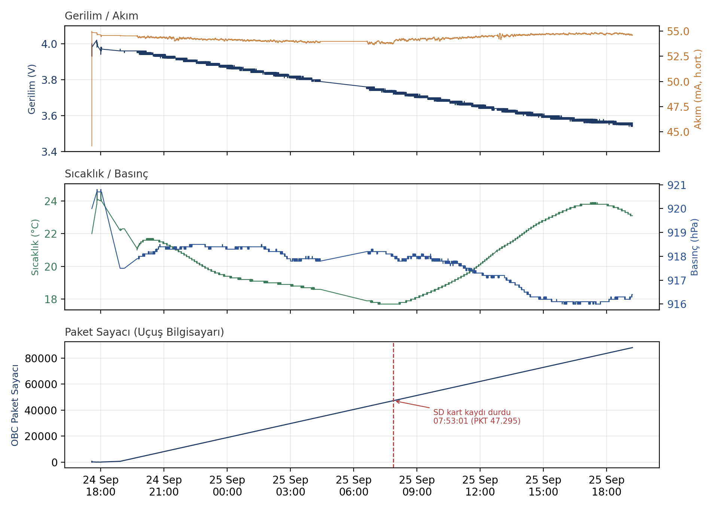

# SF Node 1 — FlatSat


1U CubeSat **Store & Forward (S&F)** haberleşme uydusu geliştirme
programının Faz 1 (FlatSat / TRL 4–5 elektriksel doğrulama) aşamasına ait
uçuş yazılımı, yer istasyonu yazılımı, ham telemetri verileri ve test
dokümanları.

Uçuş bilgisayarı (RP2040) ile yer istasyonu arasında 433 MHz LoRa hattı
üzerinden **24 saat 38 dakikalık** kesintisiz saha testi gerçekleştirilmiş;
**76.497 paket, %99,24 net RF link başarı oranı** ile doğrulanmıştır.



*Şekil 1 — 24 saatlik batarya gerilimi/akımı, sıcaklık/basınç ve OBC paket
sayacı profili (kaynak: `data/ground_telemetry.csv`)*

## Doğrulama Sonuçları

7 gereksinimden 6'sı **GEÇTİ**, 1'i (uçuş içi çift kara kutu kaydı) birincil
RF telemetri hattı kesintisiz kaldığı için **KOŞULLU** olarak kapatıldı.
Tam izlenebilirlik matrisi ve kanıtlar için `docs/SF1-FLT-TS-001_RevA.pdf`.

| No | Gereksinim | Sonuç | Durum |
|---|---|---|---|
| R-01 | I2C veri yolu adres çakışmasının çözülmesi | MPU6050 → 0x69'a ötelendi, 5 cihaz çakışmasız | ✅ GEÇTİ |
| R-02 | 433 MHz RF link bütçesi ve menzil (600 m) | %99,24 link başarısı, RSSI −99 dBm (+16 dB marj) | ✅ GEÇTİ |
| R-03 | Güç tüketimi ve ≥24 sa batarya ömrü | 54,33 mA ort., 24 sa 38 dk'da 3,98→3,56 V | ✅ GEÇTİ |
| R-04 | Çevresel (termal/barometrik) tolerans | 7,0 °C gradyanda kesinti/kayma yok | ✅ GEÇTİ |
| R-05 | Yer istasyonundan bağımsız otonom çalışma | GS çökmesine rağmen paket sayacı kesintisiz | ✅ GEÇTİ |
| R-06 | Çift kara kutu, sıfır kayıplı yerel kayıt | SD kaydı ~%53'te durdu (bkz. SF1-NCR-001) | 🟠 KOŞULLU |
| R-07 | Yer istasyonu RF kaydının sürekliliği | 76.497 paket, tüm pencere kesintisiz | ✅ GEÇTİ |

## Repo Yapısı

```
SF-Node1-FlatSat/
├── README.md
├── docs/
│   ├── SF1-FLT-TR-001_RevA1.pdf   # Teknik Proje Raporu
│   ├── SF1-FLT-TS-001_RevA.pdf    # Test Sonuç Raporu
│   └── figures/
│       └── telemetry_24h.png
├── src/
│   ├── flight/                    # Uçuş Bilgisayarı (Pico 1)
│   │   ├── main.py
│   │   ├── sd_driver.py
│   │   └── telemetry.py
│   └── ground/                    # Yer İstasyonu (Pico 2 + PC)
│       ├── bridge_pico.py
│       └── ground_station.py
├── data/                          # Ham telemetri kayıtları
│   ├── flight_telemetry.csv
│   └── ground_telemetry.csv
└── hardware/
    ├── pinout.md
    └── photos/
```

## Donanım Özeti

| Alt Sistem | Bileşen | Veri Yolu | Görev |
|---|---|---|---|
| OBC | Raspberry Pi Pico (RP2040) | — | Uçuş kontrolü, telemetri paketleme |
| COMM | AI-Thinker Ra-02 (SX1278) | SPI1 | LoRa telemetri/telekomut, 433 MHz, +14 dBm |
| EPS | INA219 | I2C0 (0x40) | Gerilim/akım/güç ölçümü |
| IMU | MPU6050 | I2C0 (0x69) | 3 eksen ivme + jiroskop |
| Manyetometre | HP5883 / QMC5883L | I2C0 (0x2C) | 3 eksen manyetometre |
| Baro | Bosch BMP580 | I2C0 (0x47) | Basınç / sıcaklık |
| RTC | Maxim DS3231 | I2C0 (0x68) | UTC zaman damgası |
| Depolama | MicroSD | SPI0 | Yerel telemetri kaydı |

Tam pin/veri yolu haritası: [`hardware/pinout.md`](hardware/pinout.md)

## Uçuş Yazılımı Görev Döngüsü

Uçuş bilgisayarı 1 Hz periyotlu tek bir görev döngüsünde çalışır:

```
Sensör Oku → SD Karta Kaydet → LoRa TX → 150 ms RX Dinle → 1 Hz Senkronizasyon
```

## Bilinen Açık Bulgu

**SF1-NCR-001** — Uçuş içi SD kart kaydı, `main.py` içindeki genel
`except: pass` bloğu nedeniyle test süresinin ~%53'ünde (13 sa 08 dk / 24 sa
38 dk) sessizce durmuştur. Birincil RF telemetri hattı etkilenmediği için
uçuşa engel değildir; kapatma kriteri ve kök neden analizi
`docs/SF1-FLT-TR-001_RevA1.pdf` Bölüm 5'tedir.

## Faz 2 Yol Haritası — SF Node 2 (1U CubeSat EM)

- 1U FDM (Fused Deposition Modeling) uydu şasisi ve 3 katlı pertinaks kule mimarisi
- Güneş panelleri ve gerçek EPS entegrasyonu (Li-Po yerine)
- GNSS alt sistemi entegrasyonu
- SF1-NCR-001 kapsamında yazılım sertleştirme: bağımsız görev (task) olarak
  çalışan donanımsal Watchdog Timer (WDT) mimarisi

## Lisans

MIT — ayrıntılar için `LICENSE` dosyasına bakınız.
